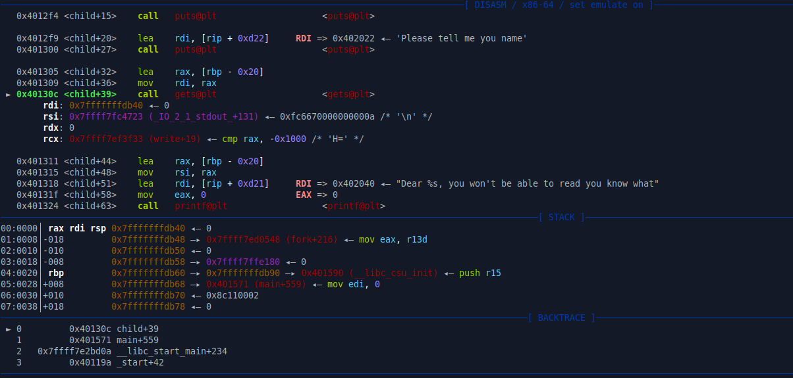
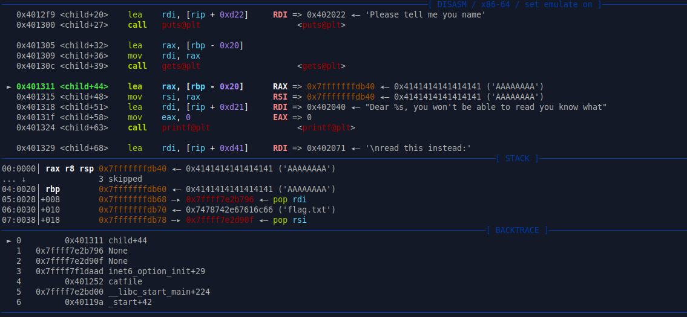
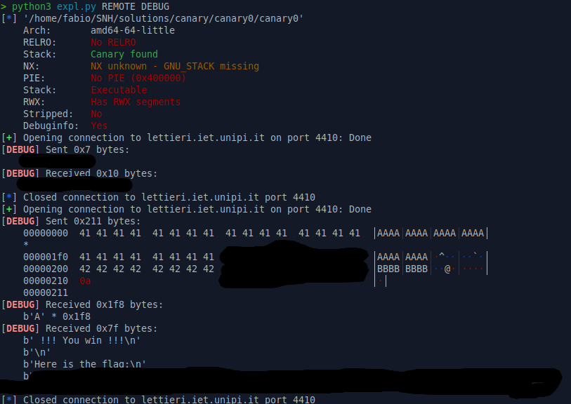
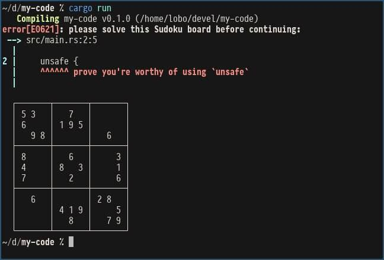

# Table of Contents
- [Tips and tricks for pwning](#tips-and-tricks-for-pwning)
    - [pwndbg](#pwndbg)
        - [Which libc am I using?](#which-libc-am-i-using)
        - [Backtrace, how to read it?](#backtrace-how-to-read-it)
        - [Printing memory regions](#printing-memory-regions)
        - [Watchpoints](#watchpoints)
        - [List of useful gdb commands](#list-of-useful-gdb-commands)
    - [pwntools](#pwntools)
        - [Context settings](#context-settings)
        - [Local vs Remote](#local-vs-remote)
        - [Getting addresses and symbols](#getting-addresses-and-symbols)
        - [Crafting payloads](#crafting-payloads)
        - [Sending and receiving data](#sending-and-receiving-data)
        - [Leaking addresses](#leaking-addresses)
        - [Interactive mode](#interactive-mode)
        - [Shellcrafting and asm](#shellcrafting-and-asm)
        - [Attach to GDB](#attach-to-gdb)
    - [How to write a good writeup](#how-to-write-a-good-writeup)
    - [Memes](#memes)

# Tips and tricks for pwning
<p align="center">
    
</p>

So you have finally decided to stop doing everything by hand, counting bytes in your head and writing complex one-liners in bash to exploit binaries. Congratulations, you are now leaving the *barbaricum* and entering the civilized world of exploit development with proper tools! 

This is a basic guide for writing exploit scripts using the Pwntools library in Python. It includes common imports, setup for local and remote exploitation, and a structure for defining the exploit logic.

Additionally it shows some neat tricks to make your exploit development easier.

Since many of you are dipping your toes into more serious exploitation, I think it is necessary to share some techniques that will help you in your journey and save you some time.

This is a work in progress, so feel free to contribute with your own tips and tricks!
### Feel free to ping me for additions or open pull request
## pwndbg 
pwndbg is an awesome GDB plugin that enhances the debugging experience for binary exploitation. It provides useful features like automatic context display, heap visualization, and more.
I will skip the installation instructions as many of you already have it installed.

Useful links (cheetsheet):
- https://gist.github.com/Enigmatrix/89b09b4c97d541df3dd9e0d8ace9ed1a 
- https://cheatography.com/cactuarnation/cheat-sheets/gdb-and-pwndbg/

When launching a binary with pwndbg and you want to pass some initial commands to GDB, you can use the following syntax from shell:
```bash
gdb vuln_binary -exec="set follow-fork-mode child" -exec="set detach-on-fork off" --exec="break main"
```
By using the `-exec` flag, you can pass multiple commands to GDB that will be executed in sequence when the debugger starts; this is particularly useful when launching multiple times the same binary and you don't want to type the same commands over and over again.

### Which libc am I using?
When exploiting binaries, it's crucial to know which libc version is being used, by default pwndbg uses the system libc, which might differ from the one used by the target binary, especially in CTF challenges.
To check which libc version is being used by the target binary, you can use the following GDB command:
```gdb
info sharedlibrary
```
This will display a list of shared libraries loaded by the binary, including libc. Look for the path of libc in the output to determine which version is being used.

## Backtrace, how to read it?
When debugging with GDB and pwndbg, you can see different *fields*: registers, instructions, stack and backtrace. The backtrace is often overlooked, but it is a powerful tool to understand the flow of the program and what is going on. Let's see how to read it.

<p align="center">
    
</p>

In the above image, we can see a backtrace with 4 frames, a more detailed version can be obtained with the command `bt full`. Each frame represents a function call in the call stack, apart from the first frame which is the instuction that is about to be executed (that's why it displays `child+39`).

The following frames represent the functions that were called to reach the current one. Meaning that `start` called `__libc_start_main` at offset 42, which in turn called `main` at line offset, which finally called `child` at offset 599. 

As of now the backtrace might not seem very useful, but after you inject your payload you may see something more interesting, for example:
<p align="center">
    
</p>

This is the backtrace after injecting a payload with a ROP chain. The backtrace shows that the after the `child` function, the next function to which the execution will return is an unknown address, being `0x7ffff7e2b796`, and then some more until we see `catfile`. This backtrace is a good indication that the ROP chain is well formed, as the return addresses will eventually land in the `catfile` function, which is the intended goal of the exploit. If for example we see the backtrace being abrouptly interrupted after a few frames or a suspicious looking address, it might indicate that the ROP chain is not well formed or that there is some issue with the payload. Naturally the backtrace alone is not enough to confirm that the exploit will work, you might have used the wrong gadgets or the wrong arguments, but it is a good starting point to verify that the control flow is being hijacked as expected. 

## Printing memory regions
Another useful feature of pwndbg is the ability to print memory regions in a more readable format. For example, if you want to inspect a structure or a buffer in memory, you can use the `x` command with different format specifiers. For example:
```gdb
x/32xb 0x7fffffffe000   # Print 32 bytes in hexadecimal
x/8xg 0x7fffffffe000    # Print 8 words (8 bytes each) in hexadecimal
x/4xw 0x7fffffffe000    # Print 4 double words (4 bytes each) in hexadecimal
x/s 0x7fffffffe000      # Print as string
```
This allows you to inspect memory contents in a more structured way, making it easier to analyze data structures, buffers, and other memory regions.
Additionally, pwndbg provides the `vis` command to visualize the heap and other memory regions, which can be very helpful when dealing with heap exploitation.
Moreover you might want to do some searches in memory, for example to find a specific string or pattern:
```gdb
search -t string "target_string"    # Search for a string in memory
search -8 42                        # Search for a specific value in memory
```
This can help you locate important data or code snippets in memory that are relevant to your exploitation efforts.
Finally you might want to do some calculations with addresses, for example to find offsets or to compute addresses of specific structures:
```gdb
p/x 0x7fffffffe000 + 0x100  # Calculate an address
p/x &some_variable + 0x20   # Calculate address of a variable plus an offset
```
This can help you navigate through memory and understand the layout of data structures in the target binary.
Content of a register can be printed with:
```gdb
p/x $rax   # Print the content of the rax register in hexadecimal
```

## Watchpoints
Watchpoints are a powerful feature in GDB that allow you to monitor changes to specific memory locations. This can be particularly useful when debugging complex programs or when trying to track down elusive bugs.
To set a watchpoint on a memory address, you can use the following command:
```gdb
watch *(type *)address
```
For example, to watch a variable of type `int` at address `0x7fffffffe000`, you would use:
```gdb
watch *(int *)0x7fffffffe000
```
Once the watchpoint is set, GDB will pause execution whenever the value at the specified address changes, allowing you to inspect the program state and understand how and when the value is modified.
You can also set watchpoints on registers, for example:
```gdb
watch $rax   # Watch changes to the rax register
```
Pay attention that watchpoints are printed before the register section in pwndbg, so if you don't see them, scroll up a bit, use the command `info watchpoints` to list them or `delete watchpoints` to remove them all.


## List of useful gdb commands
Here is a list of some useful GDB commands that can aid in debugging and exploitation:
- `break function_name` or `b function_name`: Set a breakpoint at the beginning of a function.
- `break *address` or `b *address`: Set a breakpoint at a specific address.
- `run` or `r`: Start the program under GDB.
- `continue` or `c`: Resume program execution after hitting a breakpoint.
- `step` or `s`: Step into the next instruction or function call.
- `next` or `n`: Step over the next instruction or function call.
- `finish` or `fin`: Continue execution until the current function returns.
- `info registers` or `i r`: Display the contents of all CPU registers.
- `nexti` or `ni`: Step over the next instruction (for assembly-level debugging).
- `stepi` or `si`: Step into the next instruction (for assembly-level debugging).
- `nextcall`: Step over the next function call. 
- `nextret`: Step over the next function return.
- `vis`: Visualize the heap
- `set follow-fork-mode child`: Set GDB to follow the child process after a fork.
- `set detach-on-fork off`: Prevent GDB from detaching from the child process after a fork.
- `info sharedlibrary`: Display a list of shared libraries loaded by the program
- `vmmap`: Display the virtual memory map of the process
- `set context-stack-lines N`: Set the number of stack lines to display in the context view.
- `context`: Display the current context, including registers, stack, and disassembly.
- `retaddr`: Show the return address of the current function.
- `canary`: Display the value of the stack canary if present.
- `disassemble foo`: Disassemble the function `foo`.


## pwntools
Pwntools is a powerful library for writing exploit scripts in Python. If used only for basic tasks, it's like using a Ferrari to go to the grocery store, good flex but not really necessary. Let's start with some useful tips and tricks to make the most out of it.

You can find many more details in the official documentation: https://docs.pwntools.com/en/stable/ or in the excellent cheat sheet: https://gist.github.com/anvbis/64907e4f90974c4bdd930baeb705dedf

When launching your exploit script, you can pass arguments to control its behavior. For example, you can use `REMOTE` to indicate that you want to connect to a remote service instead of running the binary locally. You can also use `GDB` to attach GDB to the process for debugging (**you must implement this decision logic**, but don't worry it is easy - shown in the local vs remote section below). 

I highly recommend using these flags to make your exploit scripts more versatile and especially use the `DEBUG` log level to get more insights about what is happening under the hood. For example:
```bash
python3 exploit.py REMOTE DEBUG
```
This will run the exploit against the remote service with debug-level logging enabled showing all the sent and received data.

```bash
python3 exploit.py GDB DEBUG
```
This will run the exploit locally, attach GDB to the process, and enable debug-level logging

Output of the `DEBUG` log level:
<p align="center">
    
</p>
As you can see, it provides detailed information about the data being sent and received, which can be invaluable for debugging your exploit.

### Context settings
Setting the context correctly is crucial for writing effective exploit scripts. It helps Pwntools understand the architecture and environment of the target binary. It is also useful for setting the logging level to control the verbosity of the output.

```python
from pwn import *

context.binary = ELF('./vuln_binary')   # Automatically sets architecture, OS, and endianness
libc = ELF('./libc.so.6')               # Load the libc binary if needed
context.log_level = 'debug'             # Set logging level to debug for detailed output - equal to launch with `python exploit.py DEBUG`
```
### Local vs Remote
When developing exploits, it's common to test them locally before deploying them against a remote service. Pwntools makes it easy to switch between local and remote execution.

```python
def get_process():
    if args.REMOTE:
        return remote('example.com', 1337)  # Connect to remote service
    elif args.LOCALSERVER:
        return remote('localhost', 1337)    # Connect to local service
    else:
        return process('./vuln_binary')     # Run local binary
p = get_process()

```

### Getting addresses and symbols
Pwntools provides convenient methods to retrieve addresses of functions and symbols from the binary and linked libraries
```python
main_addr = context.binary.symbols['main']  # Get address of main function
log.info(f"Main function address: {hex(main_addr)}")

printf_addr = context.binary.plt['printf']   # Get address of printf in the PL
log.info(f"Printf PLT address: {hex(printf_addr)}")

printf_got = context.binary.got['printf']  # Get address of printf in the GOT
log.info(f"Printf GOT address: {hex(printf_got)}")

libc_system= libc.symbols['system']         # Get address of system function in libc 
log.info(f"System function address in libc: {hex(libc_system)}")
```
These symbols, depending on the context, can be offset or absolute addresses.


Similarly, you can get rop gadgets using the ROP module:
```python
rop = ROP(context.binary)
pop_rdi = rop.find_gadget(['pop rdi', 'ret'])[0]
log.info(f"pop rdi; ret gadget address: {hex(pop_rdi)}")
```
Pay attention that this can be janky at times, I highly recommend to double check the addresses with ropper. If you already found the gadgets manually, you can always hardcode them in the following way:
```python
pop_rdi = p64(0x40123b) # Address of 'pop rdi; ret' gadget
```

### Crafting payloads
Pwntools provides the `flat` function to help you create payloads easily. It automatically handles packing and alignment for you.
```python
payload = flat(
    b'A' *  cyclic_find(0x6161616161616761),  # Offset to return address
    pop_rdi,
    next(context.binary.search(b'/bin/sh\x00')),  # Address of "/bin/sh" string
    libc_system
)
```
Now, this might be a bit advanced for beginners, you can always craft the payload manually using `p64` to pack addresses:
```python
payload = b'A' * 42  # Manual offset to return address
payload += p64(pop_rdi)
payload += p64(address_of_bin_sh)  # address of "/bin/sh" string
payload += p64(libc_system)
```

### Sending and receiving data
Pwntools provides convenient methods to send and receive data from the target process or remote service.
```python
p.sendline(payload)          # Send payload followed by a newline
response = p.recvuntil(b'Expected Prompt')  # Receive data until a specific prompt
log.info(f"Received response: {response}")
```
There are many other methods available for sending and receiving data, such as `send`, `recv`, `recvline`, `recvn`, etc. Refer to the Pwntools documentation for more details. 

### Leaking addresses
When exploiting binaries with ASLR enabled, leaking addresses is often necessary to bypass protections. Pwntools can help you parse leaked addresses easily.
```python
leak = p.recvline().strip()  # Receive a line containing the leaked address
leaked_address = u64(leak.ljust(8, b'\x00')) # Unpack the leaked address
log.info(f"Leaked address: {hex(leaked_address)}")
```
This example assumes the leaked address is 6 bytes long and pads it to 8 bytes for unpacking. Adjust accordingly based on your specific leak format.

### Interactive mode
After sending the exploit payload, you might want to interact with the spawned shell or process. Pwntools provides an easy way to do this.
```python
p.interactive()  # Switch to interactive mode
```
This allows you to interact with the process as if you were using a terminal, which is especially useful for shell exploits.

### Shellcrafting and asm
Pwntools includes a shellcraft module that allows you to generate shellcode for various architectures easily
```python
shellcode = asm(shellcraft.sh())  # Generate shellcode for spawning a shell
log.info(f"Generated shellcode: {shellcode.hex()}")
```
You can then use this shellcode in your payloads as needed, don't forget to set the correct architecture in the context which will be used by the `asm` function. If you have the binary loaded in context, it will be set automatically.

Additionally, you can generate single asm instructions:
```python
pop_rdi_instr = asm('pop rdi; ret')  # Generate machine code for 'pop rdi; ret' instruction
log.info(f"Generated pop rdi; ret instruction: {pop_rdi_instr.hex()}")
```
This can be useful when you know that the injected payload will be executed as code, but for some reason you can't simply inject a shellcode or specific gadgets are not available.

### Attach to GDB
Pwntools makes it easy to attach GDB to your process for debugging. This is particularly useful when developing and testing exploits and you want to inspect the state of the process.
```python
context.terminal = ["tmux", "splitw", "-h"] # my personal preference, to use this launch the script inside a tmux session
if not args.REMOTE and args.GDB:
    gdb.attach(p)
    pause()  # Pause execution to allow GDB to attach
```
This will launch GDB in a new terminal window and attach it to the running process, most likely pwndbg will be inside a strange looking function (read, accept, etc.), you can exit it with the `fin` command to return to the previous call in the backtrace.

I suggest you to attach GDB right before sending the payload, so you can debug the exploit and see how the process behaves after receiving your payload; you can still launch the program with GDB from the start in another terminal and then use that GDB session instead, the choice is yours.

Depending on the binary behavior, you might need to set some breakpoints or follow forks, for example this is the setup for rop3 challenge:
```python
context.binary = ELF('./rop3')
local_instance = process('./rop3')
context.terminal = ["tmux", "splitw", "-h"]
gdb.attach(local_instance, """
           set follow-fork-mode child
           set detach-on-fork off
           br child
           """)
pause()
p = remote('localhost', 4493)
p.sendline(payload)
p.interactive()
```
Pay attention that, in this case, I've taken no precautions to select which libc to use, meaning that gdb might use the your system libc, not the one provided with the challenge. This might lead to confusion when debugging, so be careful.


## How to write a good writeup
A simple copy paste from: https://lettieri.iet.unipi.it/snh-ctfd-25/writeups/2700

You got the flag, congratulations! Now it's time to craft a well-organized writeup that demonstrates your work and helps others learn from your experience.

There is no <em>right way</em>™️, although there certainly is a wrong one, to produce a writeup , it's plenty of examples from which to take inspiration, but usually we can reduce a writeup to three main steps plus one:
<ol>
    <li> Vulnerability analysis
    <li> Attack vector
    <li> Attack implentation
    <li> Patch implementation (optional but recommended)
</ol>
Naturally you also need to include the flag, if found. 

### Vulnerability analysis
The Vulnerability analysis section contains all the information for the reader to understand what is the vulnerability and what does it actually means for the task at hand. For example:
    
    char buf[256];
    gets(buf);

    Using `gets()` without bounds checking can lead to a buffer overflow because it doesn't restrict input length.
    This allows an attacker to overwrite adjacent memory, potentially controlling program flow.

The above example is a code vulnerability, but vulnerabilities aren’t always in source code. For example, if the binary is compiled without security features like NX (No eXecute) or PIE (Position Independent Executables), these are important details to include. 

### Attack vector
This section describes your high-level plan for exploiting the vulnerability. Think of it as an overview of how you intend to leverage the vulnerability to achieve your goal.

For example, if exploiting a buffer overflow, explain how you plan to overwrite the return address to redirect the program execution and for what purpose. Mention techniques like ROP (Return-Oriented Programming), stack pivoting, or other methods you intend to use.

### Attack implementation
This part is where you get into the technical details. The attack implementation section is often seen as the most important part of the writeup, and for good reason (but this does not mean that you can ignore the previous ones). 

You should include code snippets, commands, and explanations that show each step of your exploitation process. You should explain how you implemented your attack plan from the previous section, and provide any necessary context for the reader to understand your code. This section should be detailed enough that someone else could replicate your attack based on the information provided.

As a general rule of thumb, you should always try to explain <em>why</em> you are doing something, not only <em>what</em> you are doing, do not just dump a code snippet, explain what the code does and why you are using it. 

For example, if you are dealing with a PIE enabled binary and you leaked an address to bypass ASLR, explain how you did so, why that leak was possible, and how you used it to calculate the base address of the binary.

Finally here is where you should put the flag to show your accomplishment.

### Patch implementation
This section is not common, but it is always a good idea to include it, especially if you are in the learning phase. (In the exam it will be required) 

In this section, you should describe how the vulnerability could be fixed whether by applying bounds checks, replacing unsafe functions with safer alternatives, or enabling security features like ASLR, NX, or stack canaries.

Explain your patch and why your attack would no longer work. This not only shows your grasp of the vulnerability but also your understanding of an effective mitigation.

### General rules of thumb
- Don't just assume something it is obvious, explain it
- The writeup should allow the reader to reproduce the attack completely 
- Comment code snippets, don't just dump them
- If calculations are needed, show them and their results
- Writeup should be easy to read and follow, take your time to format it properly

### When editing your writeup after a comment, please use the [edit] tag to show the changes 


## Memes
When doing binary exploitation or doing challenges in general, you will bash your head against the wall many times. Here are some memes to cheer you up during those frustrating moments and to share with your friends to let them know what you are going through!

Interesting link: 
- https://x.com/i/status/1517501223938764802 
- https://www.youtube.com/shorts/FbeaklEkMgM
<p align="center">




</p>